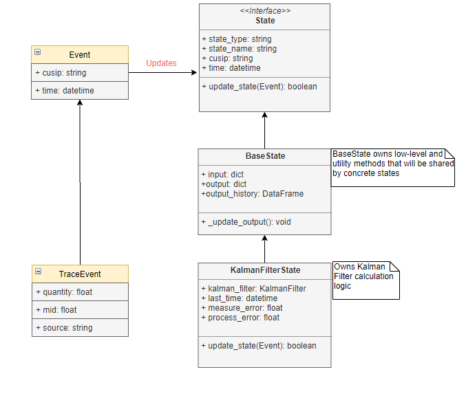

# Mid-price Estimation for U.S. Corporate Bond by Kalman Filter 

## Table of contents
1. [Introduction](#introduction)  
    
2. [Model Setup](#model_setup)  
    2.1 [Model Input](#model_input)  
    2.2 [Data Preprocessing](#data_preprocessing)  
    2.3 [Kalman Filter for TRACE](#kftrace)  
    2.4 [Choice of $Q_k$ and $R_k$](#qkrk)  
    2.5 [Self-Refresh between Consecutive TRACE Prints](#selfrefresh)
3. [Implementation](#implementation)  
    3.1 [Event and State](#event_and_state)   
    3.2 [Model Diagram](#model_diagram)    
4. [Sensitivity Analysis](#analysis)    
    4.1 [Fast and Slow Filter](#fastslow)  
    4.2 [Large and Small Trades](#largesmall)
5. [How can we do differently?](#diff)  
    5.1 [Strategically](#strat)   
    5.2 [Tactically](#tact)

## 1. Introduction   

With recent electronification of fixed income markets, vast majority of U.S. corporate bond trades are done on electronic trading (E-Trading) platforms, see, e.g., [Greenwich Data report](https://www.greenwich.com/blog/challenge-trading-corporate-bonds-electronically). 

Many market participants choose particle filtering techniques to handle noisy market data and to produce more accurate price estimates. Among many different filtering algorithms, Kalman Filter is a natural first choice. For example, [Trumid](https://www.trumid.com/files/FVMP_Whitepaper_2019.pdf) explicitly states that "their model is built around a customized Kalman Filter that integrate these data sources into a single fair value price." 

 The Kalman Filter is one of the often-used mathematical tools for stochastic estimation. It is essentially a set of mathematical equations that implement a predictor-corrector type estimator that is *optimal* in the sense that it minimizes the estimated *error* covariance. Kalman Filter is easy to implement and interpret, and is very robust, even if its assumptions are seldom satisfied, it still gives good output. 

In this note, we discuss an application of Kalman Filter to produce more accurate mid-level prices for U.S. corporate bonds.

## 2. Model Setup 
We set up a model to predict real-time mid-level of a investment grade corporate bond (identified by CUSIP). On a very high level, the model consumes TRACE data of a single CUSIP and predicts it's mid prices in real-time.
    
### 2.1 Model Input   
    
The key input of the model is [TRACE](https://www.finra.org/filing-reporting/trace) (The Trade Reporting and Compliance Engine) data. TRACCE contains almost real-time OTC secondary market transactions of corporate bonds in U.S.

### 2.2 Data  Preprocessing 

To get useable TRACE prints to feed into the model, certain preprocessing procedures must be done. 

First of all, raw TRACE prints contain duplications, cancels, etc. Effective measures have been developed to remove erroneous TRACE prints, see, e.g, [How to clean TRACE data](https://sf.cbs.dk/jdnielsen/how_to_clean_trace_data). 

On the other hand, our model needs mid-level input, however,TRACE prints come with sided prices, i.e., buy or sell. Thus we have to adjust each sided-level to mid-level. The idea is to first deduce an appropriate bid/offer width, then arrive at mid-level by adding/substracting on top of sided price for each print. For simplicty, the width can be modeled as 

$$
\text{width} = f(\text{trade quantity}, \text{bond liquidity})
$$ 

for a predetermined function $f$. Note that function $f(x,y)$ should be non-increasing in both $x$ and $y$ to reflect the belief that illiquid bonds have wider spreads.  
        
Below are sample TRACE prints after preprocessing and are ready to feed into our model.

|    | source   | cusip     |      mid |         quantity | time                |
|---:|:---------|:----------|---------:|-----------------:|:--------------------|
|  0 | TRACE    | 48129C108 |  97.43 | 67000           | 2020-03-17 07:44:28 |
|  1 | TRACE    | 48129C108 |  98.13 | 890000           | 2020-03-17 07:59:36 |
|  2 | TRACE    | 48129C108 | 101.38  | 99000           | 2020-03-17 08:04:03 |

### 2.3 Kalman Filter for TRACE 
Mathematically, let $\{x_k\in \mathbb R: k = 1,2,3\}$ denote the state variables (in our case, mid levels), $\{z_k\in \mathbb R: k = 1, 2,...\}$ denoted the measurement levels (in our case, TRACE prints), we have 
\begin{eqnarray}\label{mid_kf_model}
x_{k+1} &=& x_k + \omega_k,\\
z_{k+1} &=& x_{k+1} + \nu_{k+1}.
\end{eqnarray}
The random variables $\omega_k$ and $\nu_k$ represent the *process noise* and *measurement noise* respectively. They are assumed to be independent and normal:
\begin{eqnarray}
\omega_k &\sim& N(0, Q_k)\\
\nu_k &\sim& N(0, R_k)
\end{eqnarray}

Define $\hat x^-_k\in \mathbb R$ to be *a priori* mid estimate at step $k$ given all infomation of the process prior to step $k$ and $\hat x_k\in\mathbb R$ to be *a posterior* mid estimate at step $k$ given measurement $z_k$. We further define *a priori* and *a posterior* estimate error as 
\begin{eqnarray}
e^{-}_k = x_k - \hat x^{-}_k\\
e_k = x_k - \hat x_k. 
\end{eqnarray}

The *a prior* estimate error variance is then 
$$P^{-}_k = E[(e^{-}_k)^2]$$ and the *a posterior* estimate error variance is 
$$P_k = E[e^2_k].$$

The Kalman Filter is designed with goal to find an equation that computes an *a posterior* mid estimate $\hat x_k$ as a linear combination of an *a prior* mid estimate $\hat x^{-}_k$ and a weighted difference between an actual measurement $z_k$ and a measurement prediction $\hat x^{-}_k$. Thus, we write

$$\hat x^k = \hat x^- + K_k (z_k-\hat x^-_k).$$

The difference $z_k - \hat x^-_k$ is called measurement *innovation* or the *residual*. The coefficient $K_k$ is called *Kalman gain* and is chosen to minimize *a posterior* estimate error $P_k$. By taking direvative and set it to be zero, we can obtain the resulting $K_k$ is given by

$$K_k = \frac{P^-_k}{P^-_k + R_k}.$$

The formula above is intuitive in two folds. First, as the measurement error variance $R$ approaches 0, the gain $K_k$ weights the residual error more heavily, that is, we trust more on the measurement:
$$
\lim_{R_k\rightarrow 0} K_k = 1.
$$

On the other hand, as the *a prior* estimate error variance $P_k^-$ approaches 0, the gain $K_k$ weights the residual less heavily, that is, we trust less on the measurement but more the *a prior* estimate:
$$
\lim_{P_k^-\rightarrow 0} K_k = 0.
$$

Each iteration $k$ includes two steps, *predict* and *update*. 
#### Prediction
\begin{eqnarray}
\hat x^{-}_k &=& \hat x_{k-1}\\
P^-_k &=& P_{k-1} + Q_{k-1}
\end{eqnarray}
#### Update
\begin{eqnarray}
K_k &=& \frac{P^-_k}{P^-_k + R_k}\\
\hat x^k &=& \hat x^-_k + K_k(z_k-\hat x^-_k)\\
P_k &=& (1-K_k)P^-_k
\end{eqnarray}

Below is a sample output of running Kalman Filter on TRACE prints. The purple line represents TRACE prints and the bubble size reflects relative trade size. The red and green lines are model outputs, i.e., the model's estimate for the mid price and standard deviation at each timestamp given TRACE input.

### 2.4 Choice of $Q_k$ and $R_k$ 

As we see from last section, $Q_k$ and $R_k$ represents *process noise* and *measurement noise* respectively. A naive implementation could let $Q_k$ and $R_k$ be constant, i.e., not changing at each step. However, such treatment may lead to poor performance. 

Let's first look at $Q_k$, which captures the mid price evolvement. Consider the senario that we have observed the interested bond has been trading at par for the past few weeks, and the last prior was 105, 5% away from market's expectation. That indicate we are probably very wrong on the mid evolvment, thus we better scale up $Q_k$. 

As of $R_k$, consider an illiquid bond, and the case that we have waited for two weeks until we observe a new print, and the trade size is very small. Consider another liquid bond, which we have observed two or three round lot prints in every single day. The measurement noise $R_k$ under those two cases should not be treated as the same. Intuitively, we better scale measurement noise $R_k$ according to recent trade history, the business time interval since last observation, etc.

In this model, $Q_k$ and $R_k$ are scaled at each iteration following the idea discussed above. Implementation details can be found in file state.py.In particular, scale for $Q_k$ is simply $\frac{\hat x^-_k}{100}$, and scale for $R_k$ is $\frac{1e^6}{\min(\text{quantity}, 1e^6)}$.

### 2.5 Self-Refresh between Consecutive TRACE Prints 

By nature of the Kalman Filter, *update* happens whenever we observe a new measurement. However, for illiquid bonds mentioned above, we may need to wait for a long time until next TRACE prints. Would the algorithm keep silent for two weeks and suddenly alarm? No.

To resolve the issue, we add self-made events, called 'self-refresh', to the model. Every five minutes, the model is forced to update or refresh itself, by making a naive guess and increass variance accordingly. To achieve that, we simply enrich the input market data with artificial records. For example, the TRACE sample prints above would be enriched into table below. 

|    | source   | cusip     |      mid |         quantity | time                |
|---:|:---------|:----------|---------:|-----------------:|:--------------------|
|  0 | TRACE    | 48129C108 |  97.4361 | 67000           | 2020-03-17 08:44:28 |
|  1 | self-refresh   | 48129C108 |   |            | 2020-03-17 08:45:00 |
|  2 | self-refresh   | 48129C108 |   |            | 2020-03-17 08:50:00 |
|  3 | self-refresh   | 48129C108 |   |            | 2020-03-17 08:55:00 |
|  4 | TRACE    | 48129C108 |  98.1371 | 890000           | 2020-03-17 08:59:36 |
|  5 | self-refresh   | 48129C108 |   |            | 2020-03-17 09:00:00 |
|  6 | TRACE    | 48129C108 | 101.383  | 99000           | 2020-03-17 09:04:03 |

## 3. Implementation 

The model is implemeted in Python. The core idea is to abstract concepts of *Event* and *State*, and recognize each *Event* has effects on model's *State*, and thus let computers make sense of a simple English sentence: "Incoming market events keep affecting model output".

### 3.1 Event and State 
An *Event* is understood to be something that has effects on the model. For example, a new TRACE print with quantity 10,000 and price 98.83 is regarded as a TRACE *Event*, and is consumed by the model. Note that *Event* may not necessarily be something that has really happened. It could be model's self-check, self-refresh, etc.  Currently, *Event* is encapsulated as a class without any method registered, see event.py for details.

The *State* is understood to represent the model's output, as well as other useful infomation. For example, the TRACE *Event* above may change the model's *State* by driving it's final mid estimate closer to 98.83 and reduce its variance. 

*State* is implemented in *state.py*, in which *State* serves as an anstract class. *State* defines a method called *update_state(Event)*, which accepts an *Event* and updates the *State*. All inherited *State* should implement this method, at a minimum. 

### 3.2 Model Diagram 
Below is the UML (Unified Modling Language) of the current implementation. At first glance, the implementation seems more complicated than the idea of running Kalman Filter. However, such implementation makes the following much easier:
* Onboarding a new market input source
* Adopting new strategies to existing/new market input sources
* Running numerous strategies on the same market input source simultaneously and compare performances
* Modelling dependence between different market inputs

### 3.3 SOLID Check
Although this is a very simple design, let's check if it satisfies the SOLID principle.
* **S**ingle Responsibility: each of our class clearly has a single responsibility, e.g., KalmanFilterState does and only does the calculation logic of Kalma Filter

* **O**pen/Close: our program is open to extension, i.e., onboarding new algorithms, but close to modification, i.e., the business logic in our core library does need to change.

* **L**iskov Substitution: each object should be replaceable with instances of their subtypes without altering the correctness of the program. We satisfy this principle as well due to the abstraction of *State* and *Event*

* **I**nterface Segregation: none of our objects implements a method that it does not need to

* **D**ependency Inversion: our abstraction of *State* and *Event* does not depend on concrete implementation

    
## 4. Sensitivity Analysis      

In this section we conduct a few simple sensitivity analysis. I chose mid level $\text{mid} = 100$ and simulated 20 distinct TRACE prints $z_k$. The error for mid-level is normally distributed with mean 0 and standard deviation of 0.1. The TRACE quantity is simulated uniformly from an interval (500k, 1m) and interval time is simulated from a Poisson distribution with mean 15 minutes. 

### 4.1 Fast and Slow Filter 
Changing or tuning parameters $Q_k$ and $R_k$ will lead to different filter performance. 

In below figure, $R_k$ is in default setting.

However, when we scale $R_k$ up by a factor of 100,the filter was essentially told that the measurement noise is 100 times greater than previous one, thus the filter became 'slow' in trusting the measurement. In the meantime, the filter's variance becomes much greater, settling around 20 compared to 0.5 in previous figure.

### 4.2 Large and Small Trades 

We then examine the trade size effect in this model. In out setting, we expect small trade size to scale measurement error $R_k$ up, and thus leads to a slower filter with greater variance. The plot below is in the same setting as the first figure, but the trade quantity is 10 times smaller. As we can see, the filter indeed became slower and variance went up.

## 5. How can we do differently? 

### 5.1 Strategically 

* Use General Particle Filter

Kalman Filter is easy to implement, however, its assumptions are usually not met or difficult to check. That is, the error terms may not be Gaussian. To overcome the issue, more general particle filting algorithms have been studied in bond trading space. For example, this 2019 [paper](https://arxiv.org/pdf/1810.05884.pdf) discussed a particle filtering approach for European corporate bond mid-estimation.

* Consider multiple CUSIPs from the same issuer/sector

Our current model is applied to single CUSIP. However, it's worth thinking how to incorporate information from other CUSIPs from the same issuer or the same sector and have similar maturity.

### 5.2 Tactically 
* Parameter Tuning   

As we see from previously sensitivity analysis, choice of model paramters has huge influence on the model performance. Tuning all parameters into good shapes and keep re-calibration according to market conditions are necessary steps to keep the model healthy.

* Finer Control  

Similar to parameter choice, we may pose additional controls on the parameters. For example, if at any iteration step the standard deviation goes beyond certain threshold, we may need to force it back to an initial level and record such irregular behavious for analysis.